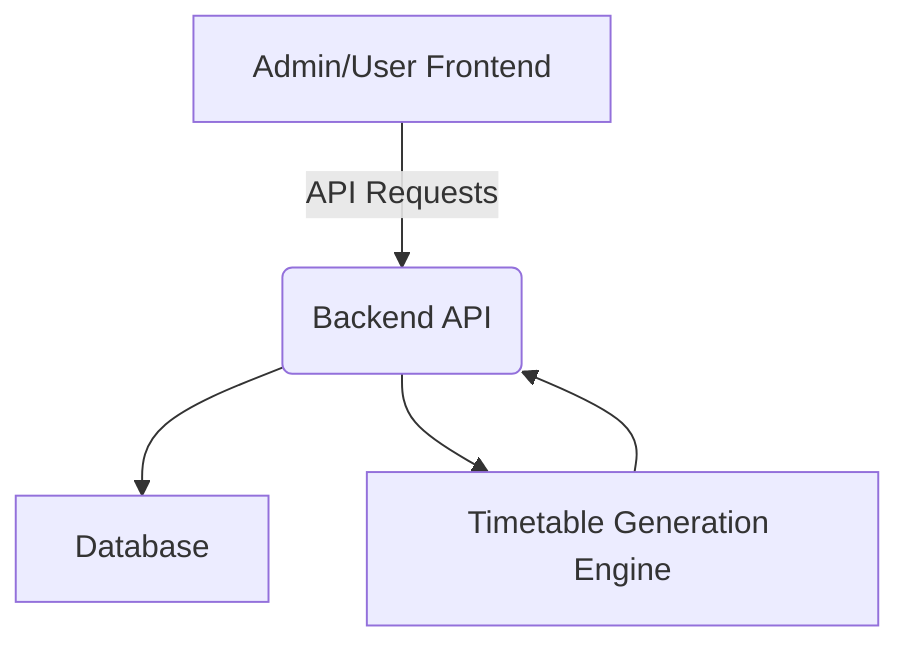

# TimeTable Management System - Design Document

## 1. Introduction
This document outlines the design and requirements for the TimeTable Management System. The primary purpose of this application is to streamline the process of creating and managing academic timetables for educational institutions. It aims to provide an optimized solution for scheduling classes, considering various constraints such as teacher availability, subject allocation, and daily schedules.

## 2. Functional Requirements

### Admin Module
The Admin module provides comprehensive tools for managing all aspects of timetable generation and configuration.

*   **Input Management:**
    *   **Manage Semesters:** Admins can add, edit, and delete semester details (e.g., semester name, start date, end date).
    *   **Manage Teachers:** Admins can add, edit, and delete teacher profiles, including assigning subjects they can teach and defining their general availability.
    *   **Manage Classes/Subjects:** Admins can add, edit, and delete class/subject details, including assigning them to specific semesters and linking them to qualified teachers.
    *   **Define Daily Schedule/Timings:** Admins can configure the daily class schedule, specifying start and end times for classes, as well as incorporating lunch breaks and other non-teaching intervals. This schedule is assumed to be consistent for every working day.
    *   **Configure College Working Days:** Admins have the option to select the number of days the college operates in a week (e.g., 5 days, 6 days).

*   **Timetable Generation:**
    *   **Optimized Timetable Generation:** The system will generate an optimized timetable based on the inputs provided by the Admin. This process will consider all defined constraints to produce an efficient and clash-free schedule.
    *   **Clash Detection and Resolution:** During the generation process, the system will automatically detect and attempt to resolve any scheduling conflicts (e.g., a teacher assigned to two classes at the same time, a classroom double-booked).

### User Module (Future Enhancement)
The User module will provide a read-only interface for students and other users to view the generated timetables.

*   **View-Only Access:** Users will be able to access and view the published timetables without the ability to make any modifications.

## 3. Future Enhancements (Non-functional Requirements / Roadmap)

*   **Admin Interactive Modification:**
    *   **Interactive Class Modification:** Admins will have the ability to manually add, delete, or modify individual classes within an already generated timetable.
    *   **Real-time Revalidation:** Upon any interactive modification, the system will immediately revalidate the entire timetable to detect and highlight any new clashes or potential deadlocks, ensuring the integrity of the schedule.

*   **Advanced Clash Detection:**
    *   **Sophisticated Algorithms:** Implementation of more advanced algorithms to handle complex scheduling scenarios, prevent deadlocks, and ensure optimal resource allocation across all constraints.

## 4. System Architecture (High-Level)

The TimeTable Management System will follow a client-server architecture, typically implemented as a web application designed for local deployment.



*   **Proposed Tech Stack for Local Deployment:**
    *   **Frontend:** React.js (or similar modern JavaScript framework like Vue.js/Angular) for a dynamic and interactive user interface.
    *   **Backend:** Node.js with Express.js for a robust and scalable API server.
    *   **Database:** SQLite (for simplicity and ease of local setup) or PostgreSQL/MySQL (for more robust data management, still locally deployable). SQLite is recommended for initial local development.
*   **Components:**
    *   **Frontend:** This will be the user interface layer, providing interactive forms for Admin inputs and display views for timetables. It will communicate with the Backend API.
    *   **Backend API:** This layer will handle all business logic, process requests from the frontend, manage data persistence, and orchestrate the timetable generation process.
    *   **Database:** A relational or NoSQL database will be used to store all application data, including semesters, teachers, subjects, daily schedules, and the generated timetable entries.
    *   **Timetable Generation Engine:** This is the core algorithmic component responsible for taking all inputs and constraints to produce an optimized timetable. It will likely employ techniques from constraint satisfaction problems or operational research.

## 5. Data Model (Conceptual)

The following entities represent the core data structures within the system:

```mermaid
erDiagram
    SEMESTER {
        VARCHAR ID PK
        VARCHAR Name
        DATE StartDate
        DATE EndDate
    }
    SUBJECT {
        VARCHAR ID PK
        VARCHAR Name
        VARCHAR Code
        VARCHAR SemesterID FK
        VARCHAR AssignedTeacherID FK
        INT DurationMinutes
    }
    TEACHER {
        VARCHAR ID PK
        VARCHAR Name
        VARCHAR SubjectsTaught
        VARCHAR Availability
    }
    DAILY_SCHEDULE {
        VARCHAR ID PK
        VARCHAR DayOfWeek
        TIME StartTime
        TIME EndTime
        VARCHAR BreakTimes
    }
    TIMETABLE_ENTRY {
        VARCHAR ID PK
        VARCHAR SemesterID FK
        VARCHAR SubjectID FK
        VARCHAR TeacherID FK
        VARCHAR Day
        TIME StartTime
        TIME EndTime
        VARCHAR Room Optional
    }

    SEMESTER ||--o{ SUBJECT : has
    TEACHER ||--o{ SUBJECT : teaches
    SUBJECT ||--o{ TIMETABLE_ENTRY : scheduled_as
    DAILY_SCHEDULE ||--o{ TIMETABLE_ENTRY : defines_slot
    ADMIN }|--|{ SEMESTER : manages
    ADMIN }|--|{ TEACHER : manages
    ADMIN }|--|{ SUBJECT : manages
    ADMIN }|--|{ DAILY_SCHEDULE : manages
    ADMIN }|--|{ TIMETABLE_ENTRY : generates
    USER }|--o{ TIMETABLE_ENTRY : views
```

*   **Semester:** Represents an academic period.
*   **Teacher:** Stores information about instructors, including their assigned subjects and availability.
*   **Subject/Class:** Details about individual courses or classes, linked to semesters and teachers.
*   **DailySchedule:** Defines the structure of a typical day, including class timings and breaks.
*   **TimetableEntry:** Represents a single scheduled class slot within the timetable, linking subjects, teachers, and specific times/days.

## 6. Timetable Optimization Approach (High-Level)

The timetable generation will be approached as a Constraint Satisfaction Problem (CSP). The system will aim to find a valid assignment of subjects to time slots, teachers, and potentially rooms, while satisfying all defined constraints.

**Key Considerations:**
*   **Teacher Availability:** Ensuring teachers are not double-booked and are assigned classes within their specified availability.
*   **Subject-Teacher Mapping:** Validating that subjects are taught by qualified and assigned teachers.
*   **Class Duration:** Allocating appropriate time slots based on the duration required for each subject.
*   **Room Availability (Future):** If room management is integrated, ensuring rooms are not double-booked.
*   **Minimizing Clashes:** The primary objective is to generate a timetable with zero clashes, or to highlight unavoidable clashes for manual resolution.